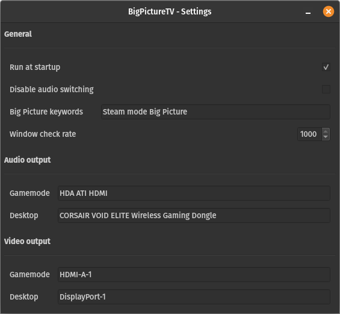

# BigpictureTV-Linux

Python daemon to automate switching from PC to TV when launching Steam in big picture mode.
Supports X11, gnome-wayland and plasma-wayland.

*Looking for the [windows version](https://github.com/Odizinne/BigPictureTV)?*




## Dependencies

- `wmctrl` for window detection
- `pactl` for audio device manipulation
- `xrandr` for screen detection and manipulation under X11
- `gnome-randr` (work only with [my custom version](https://github.com/Odizinne/gnome-randr-py)) in path for gnome-wayland support
- `PyQt6`

## Installation

- Download [latest release]()
- run `install.sh`

## Usage

Both audio settings should be filled with device description. You can get it from `pactl list sinks | grep device.description`

Output should look like this:

```bash
flora@fedora:~/Projects$ pactl list sinks | grep device.description
        device.description = "CORSAIR VOID ELITE Wireless Gaming Dongle"
```

If you plan to switch to HDMI audio, be sure to turn on your HDMI monitor before running this command, else it wont be listed here.

I do not recommand going below 100ms for check rate. If unsure, do not edit.

## My titlebar look weird on gnome-wayland

add variable QT_QPA_PLATFORM=xcb